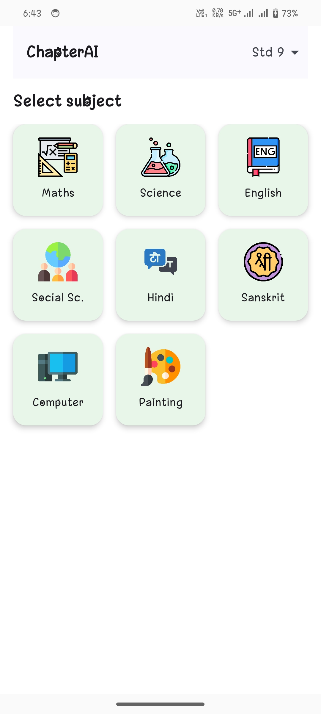
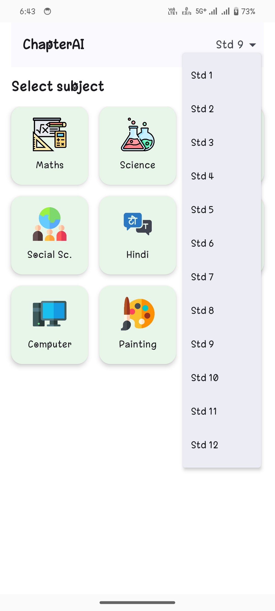
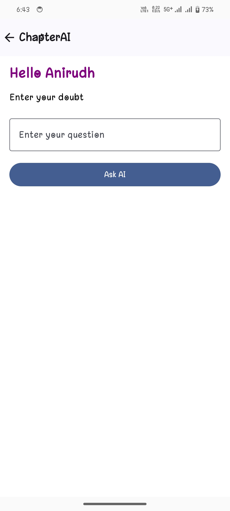
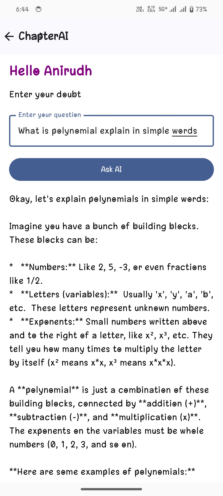

# ChapterAI

Welcome to **ChapterAI**, an educational Android application designed to assist students (e.g., CBSE Std 9) in understanding subjects like Maths, Science, and more through AI-powered explanations. This app leverages the Google Gemini API to provide contextual answers to user queries based on selected subjects, standards, and chapters.

## Table of Contents
- [Features](#features)
- [Screenshots](#screenshots)
- [API Usage Notice](#api-usage-notice)
- [APK Download](#apk-download)
- [Prerequisites](#prerequisites)
- [Contact](#contact)

## Features
- Interactive subject and chapter selection.
- AI-driven explanations for user doubts.
- Scrollable responses for long answers.
- Loading animation during API calls.

## Screenshots
| Subject Selection Screen | Class Selection Screen | List Of Chapters Screen | AI Screen | AI Explanation Screen |
|--------------------------|-----------------------|-------------------------|-----------|------------------------|
|  |  |  |  |  |